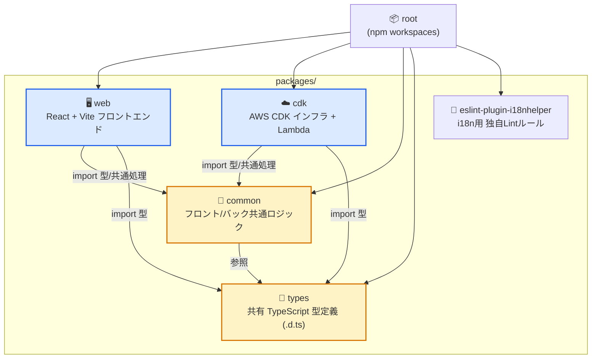
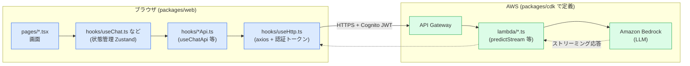
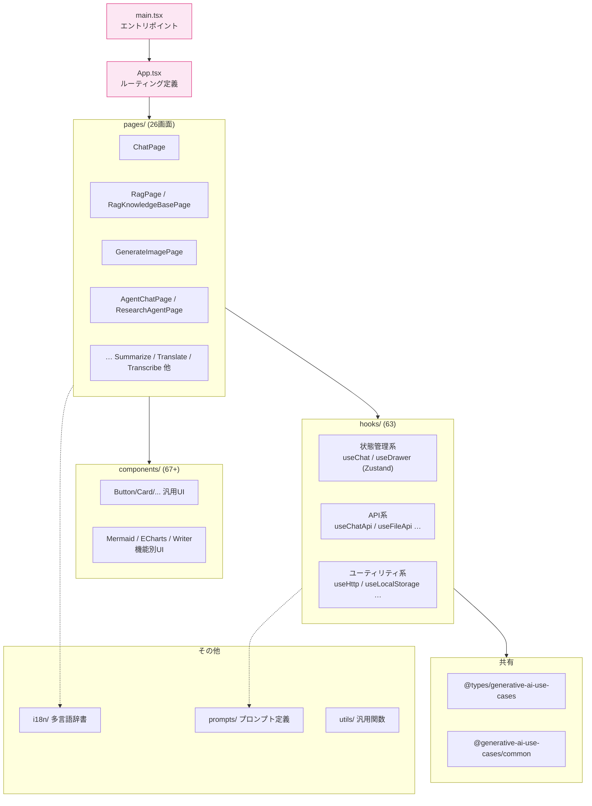
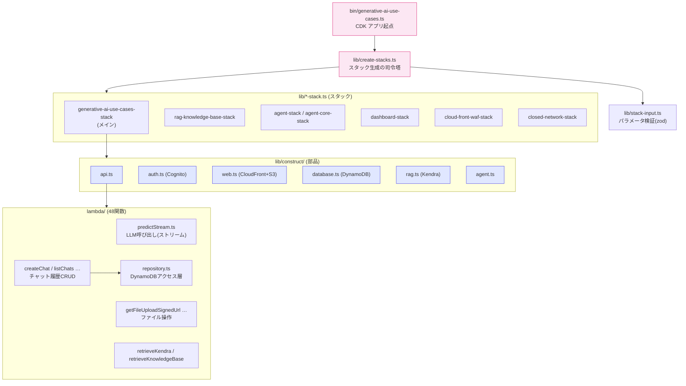

# GenU ソースコード・コードマップ

このリポジトリ（Generative AI Use Cases / GenU）のソースコード構成を、**Mermaid図**で視覚的にまとめたものです。
インフラ構成図（[arch.drawio.png](../assets/images/arch.drawio.png)）が「AWSリソースの繋がり」を表すのに対し、こちらは **「コード（パッケージ・モジュール）の繋がり」** を表します。

> Mermaid図はGitHub・VSCode（Markdown Preview Mermaid Support拡張）・mkdocs(mermaidプラグイン)でそのまま描画されます。

---

## 1. モノレポ全体構成（npm workspaces）

ルートの `package.json` は `packages/*` を workspaces として束ねています。
`common` と `types` が共有基盤で、`web`（フロント）と `cdk`（インフラ）の両方から参照されます。



| パッケージ | 役割 | 主な技術 |
|-----------|------|---------|
| `packages/web` | ブラウザで動くUI。各ユースケースの画面 | React 18 / Vite / TailwindCSS / Zustand / SWR / react-router |
| `packages/cdk` | AWSインフラ定義とバックエンドLambda | AWS CDK / TypeScript / Lambda |
| `packages/common` | フロント・バックで共有するアプリロジック | TypeScript |
| `packages/types` | 共有する型定義のみ | TypeScript (`.d.ts`) |
| `packages/eslint-plugin-i18nhelper` | 多言語対応を強制する独自ESLintルール | ESLint Plugin |

---

## 2. リクエストの流れ（フロント → インフラ → LLM）

ユーザー操作が、どのコードを通ってAWS Bedrockまで届くかの流れです。
`web`側の **hooks** がAPIを呼び、`cdk`側の **Lambda** が実処理を担います。



**ポイント**
- 画面(`pages`)は状態管理hook(`useChat`など)を呼ぶだけで、通信の詳細は知らない
- `*Api.ts` hook がエンドポイントを、`useHttp.ts` が認証ヘッダ付与を担当（責務分離）
- リクエスト/レスポンスの型は `packages/types` の `.d.ts` をフロント・バック双方が共有 → **型の齟齬が起きない**

---

## 3. フロントエンド内部構造（packages/web/src）



**設計の勘所**
- `pages` = ユースケース1つ = 1ファイル（画面追加は基本ここ＋ルート追加）
- `hooks` は **状態管理系 / API系 / ユーティリティ系** の3系統に整理されている
- ロジックはhooksに寄せ、`components`は表示に専念（テスト・再利用しやすい）

---

## 4. CDK（インフラ）内部構造（packages/cdk）



**階層の考え方（上ほど抽象）**
1. `bin/` … CDKアプリの起点
2. `lib/*-stack.ts` … デプロイ単位（**Stack**）。機能ごとに分割
3. `lib/construct/` … 再利用可能な部品（**Construct**）。API・認証・DBなど
4. `lambda/` … 実際のバックエンド処理。`repository.ts` がデータアクセスを集約

---

## 5. ディレクトリ早見表

```text
aws-genu-study/
├── packages/
│   ├── web/                    # フロントエンド (React)
│   │   └── src/
│   │       ├── main.tsx        #   エントリポイント
│   │       ├── App.tsx         #   ルーティング
│   │       ├── pages/          #   画面 (ユースケース単位, 26枚)
│   │       ├── components/     #   UI部品 (67+)
│   │       ├── hooks/          #   ロジック (状態/API/ユーティリティ, 63)
│   │       ├── prompts/        #   プロンプト定義
│   │       ├── i18n/           #   多言語辞書
│   │       └── utils/          #   汎用関数
│   │
│   ├── cdk/                    # インフラ + バックエンド (AWS CDK)
│   │   ├── bin/                #   CDKアプリ起点
│   │   ├── lib/
│   │   │   ├── *-stack.ts      #   スタック (デプロイ単位)
│   │   │   ├── construct/      #   構成部品 (API/認証/DB…)
│   │   │   └── stack-input.ts  #   パラメータ検証
│   │   └── lambda/             #   Lambda関数 (48)
│   │
│   ├── common/                 # フロント/バック共通ロジック
│   ├── types/                  # 共有型定義 (.d.ts)
│   └── eslint-plugin-i18nhelper/  # 独自Lintルール
│
├── docs/                       # ドキュメント (mkdocs)
│   └── mydocs/                 #   ← このファイルの場所
├── my-textbook/                # 学習用教科書 (react / cdk)
└── browser-extension/          # ブラウザ拡張
```

---

## 関連資料
- インフラ構成図: [../assets/images/arch.drawio.png](../assets/images/arch.drawio.png)
- 閉域網構成図: [../assets/images/arch-closed-network.drawio.png](../assets/images/arch-closed-network.drawio.png)
- CDK学習教科書: [../../my-textbook/cdk/README.md](../../my-textbook/cdk/README.md)
- React学習教科書: [../../my-textbook/react/README.md](../../my-textbook/react/README.md)
